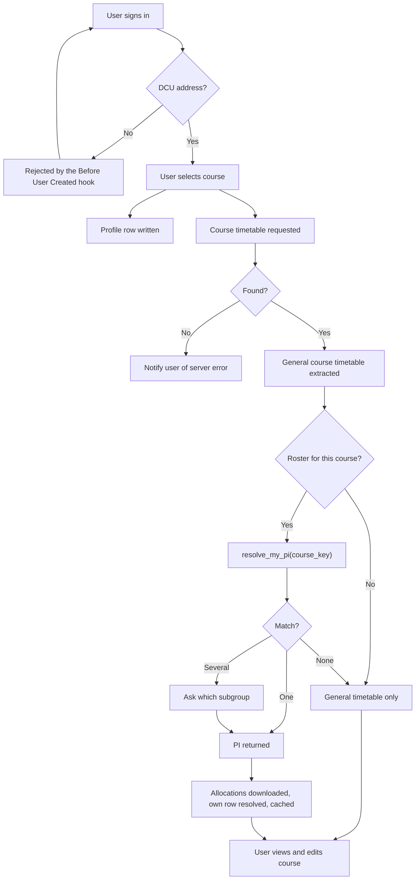

# CSV conversion pipeline and course resolution — plan

Working from `CSV Conversion Pipeline` (Mermaid, 21 Sep 2026). That diagram gets the shape
right; this fills in what it leaves open and sequences the build.

**Decisions taken (21 Sep 2026):**

1. **Option C** — pseudonymised roster on the device, random PI, name→PI map server-side.
2. **Match on given name + family name**, not surname alone.
3. **Course is selected first**, so a match is only ever attempted within one course's roster.
4. **No Claude API.** Local Qwen3-VL and PaddleOCR only, run on the 32 GB desktop.

4 supersedes `ADMIN_CONSOLE.md` §7.3 entirely; 1–3 replace the §7.4 position that nothing
personal is hosted.

---

## 1. Why the matching works

Measured against the Engineering Year 1 list (`local-data/`, 207 students):

- **Zero full-name collisions.** Given + family name uniquely identifies every student.
- **Family name alone would not.** 62 of 207 share a family name with someone else; the
  worst is shared by 9. This is why the key is both names.
- Scoping to the selected course shrinks the space further — the match runs against ~207
  rows, not the whole university.

`DCUEmail` (`ios/DCUTimetable/Core/Models/DCUEmail.swift`) already derives this: it splits
the local part on dots, strips the trailing disambiguation digit, and exposes `givenName`,
`familyName` and `displayName`.

**Still handle the collision case.** 207 students with no clash doesn't mean a 400-student
cohort won't have one, and the failure is silent — the wrong person's lab group, with no
error. Where two rows match, fall back to asking the user **which subgroup they're in**.
Never present a list of candidate names: showing someone nine classmates so they can pick
themselves is a disclosure created by the UI, not by the data store.

---

## 2. Option C in detail

The device holds the roster **pseudonymised** — random PIs against allocations, no names.
The name→PI map never leaves the server.

```
profiles                (server only)
  student_id            text        -- "A00000000", set once at account creation

roster_members          (server only, RLS: admin read)
  course_key            text
  version               int
  pi                    text        -- random, letter + 6 digits
  name_key              text        -- normalised "given family"   (nullable)
  student_id            text        -- normalised "A00000000"      (nullable)
  → at least one of name_key / student_id must be present

course_allocations      (public read — no names in it)
  course_key, version
  pi, group, subgroup
```

At first sign-in, after the user picks their course:

1. Client calls `resolve_my_pi(course_key)`.
2. The RPC (`security definer`, `set search_path = ''`) derives the name from
   `auth.jwt() ->> 'email'`, matches it in `roster_members` for that course, and returns
   **the caller's PI or null** — never another row, never a count.
3. Client downloads `course_allocations` for the course. It's inert: random identifiers
   against group letters.
4. Client resolves its own row locally and caches it. Offline from then on.

**The PI must be random, not derived from the name.** A hash of a name over a 207-person
cohort is brute-forceable in seconds — `ADMIN_CONSOLE.md` §7.4 is right about that, and it
applies to any deterministic function of the name.

One simplification worth noting: this **removes** the client-side matcher in
`ProfileCreatorView.swift:86-104`. Matching happens in exactly one place, server-side, so
there's no second implementation to drift — unlike the `event_key` trap in §6.

**What you take on.** Under C you are the controller of a hosted name→group mapping for a
few hundred people. That needs a lawful basis, a retention limit, and a deletion path
(§5). It is a real obligation, taken knowingly.

### 2.1 Student ID as a second match key

Some lecturers publish allocations keyed by student ID (`A00000000`) with no names in them
at all. That's a second key into the same roster, not a separate system.

**Collected once, at account creation.** The user types it, it's normalised (uppercase,
whitespace stripped, format checked) and written to `profiles.student_id`. It is never
exposed to another user, never sent to a device, and never used as the PI.

**Matching order.** `resolve_my_pi(course_key)` uses whichever key that course's roster
carries:

| Roster has | Match on |
|---|---|
| Names only | Given + family name, from the **verified** email |
| Student IDs only | `profiles.student_id` |
| Both | Name first; require the ID to agree. A mismatch is a flag for review, not a fallback |

The ordering matters because the two keys have different strength. The email address is
verified by the Before User Created hook — the student proved they control it. The student
ID is typed in. Anyone can type somebody else's.

**The enumeration oracle, and why the ID is set once.** If the RPC accepted an arbitrary ID
on every call, it would be a lookup service for the whole cohort: submit IDs until one
returns a PI and you've mapped everyone's allocation. Binding the ID to the account at
creation — changeable afterwards only by an admin — gives each account exactly one query,
for its own ID. Without that constraint this feature is a data leak wearing a convenience
hat.

**Why not just hash the IDs and ship those?** Same reason as names, with one difference
worth understanding rather than glossing:

- An ID is letter + 8 digits, which *sounds* like enough entropy to hash safely. It isn't —
  if DCU encodes the entry year in the leading digits, the live space for one cohort is
  small enough to enumerate in milliseconds.
- **But the consequence of reversing it differs.** Recovering a name is self-identifying;
  recovering an ID is not, unless you already hold DCU's ID→name directory. So an ID-keyed
  roster is genuinely less exposing than a name-keyed one.

That's an argument for preferring ID-keyed source documents, **not** an argument for
shipping hashed IDs. Keep the random PI on the device — it costs nothing and it's the only
option that doesn't depend on an attacker's resources.

**Never use the student ID as the PI.** The PI is random, disposable and meaningless
outside this app. The ID is permanent, externally meaningful and issued by DCU. Conflating
them would push a real institutional identifier onto every device that downloads an
allocation table.

**One genuine win.** An ID-only document contains no names, so for those courses the
ingestion pipeline never handles personal names at all — which makes the §4 model choice a
much smaller decision for them.

**Extraction validation is different, not easier.** Format (letter + 8 digits) catches
structural OCR errors well, and cohort prefix consistency catches more — one ID whose
leading digits differ from its 200 neighbours is almost certainly a misread. But a single
transposed digit is still a well-formed ID, invisible to every format check, exactly like
the `SB38`/`SB39` problem. The PaddleOCR cross-check stays the detector.

**Deletion and retention (§5) now cover two identifiers**, not one. A student ID raises how
identifying a `profiles` row is, so it belongs in the same retention answer as the roster.

---

## 3. Corrected flow

Resolving the diagram's loose ends: `n29` had no inbound edge and `n19`/`n30`/`n31` were
unconnected, with `n31` duplicating `n9`. `n29` is the general-timetable lookup that must
succeed before either branch runs; `n19` is its success, `n30` its failure.



The course-selection-first ordering is load-bearing, not incidental: it's what keeps the
match scoped and unambiguous.

---

## 4. The pipeline — one local path

Everything runs locally on the **32 GB desktop**. No API key, no network, no per-document
judgement call about which path a file goes down.

That last point is the strongest argument for the single path. A two-path design (hosted
model for rotation PDFs, local for class lists) works right up until someone sends a
name-bearing document down the hosted path by mistake. One local path makes that mistake
impossible.

**Model: `qwen3-vl-32b-instruct` at 4-bit (~18 GB).** It fits in the desktop's unified
memory budget (~21–24 GB of 32 GB) with room for KV cache, which matters because a page
image is thousands of tokens before the model writes anything.

Do **not** run this on the 16 GB laptop. There the ceiling is 8B, and 8B is materially
worse on merged cells and grid alignment — the two things these documents are made of.
macOS swaps rather than refusing to allocate, so an over-budget model doesn't error, it
just becomes unusably slow.

**The honest residual:** 32B narrows the gap to a frontier model on hard table layouts but
doesn't close it. That's what §4.2's validators and §4.3's staging gate are for, and why
the ground-truth measurement in §6 step 2 comes before anything is built on top.

**Workflow:** the repo is on the laptop, the model is on the desktop. Decide up front that
the desktop runs the whole ingestion step — model, validators, CSV output — so the only
thing crossing machines is a finished, validated CSV. Shuttling intermediate files both
ways is what gets a pipeline abandoned after two uses.

Nothing is installed yet — no ollama, no MLX, no PaddleOCR.

### 4.1 Extraction

**Feed the image straight to the model.** Pre-OCRing for a VLM throws away the spatial
layout it needs to make sense of a merged-cell table.

**PaddleOCR earns its place in two roles**, neither of them "run alongside to save tokens" —
for a dense table the OCR text is about as many tokens as the image, and decode dominates
the wall clock anyway:

1. **Triage, in series.** PP-Structure first; clean ruled pages with confident structure are
   taken as-is and never reach the VLM. Only failures escalate. Running both on every page
   is a pure cost.
2. **Cross-check.** On pages that did reach the VLM, diff the two extractions and surface
   disagreements — this catches the failure mode a local model actually has, a confident and
   plausible wrong cell. It stays worth doing at 32B, because digit confusion
   (`SG23`/`SG24`/`SG25`, `SB38`/`SB39`) is the dominant error and two independent systems
   rarely make the same one.

**Cut output tokens, not input tokens.** `day`, `workshop` and `drawing` are a function of
`subgroup`, so have the model emit only `name, subgroup` and derive the rest locally.
Roughly 3× less decode. Emit CSV, not JSON.

### 4.2 Validation before anything is stored

The structure is constrained enough that deterministic checks catch most errors:

- Every `subgroup` is one of the 16 known values.
- Subgroup sizes are near-identical — measured: 13 each, 12 for `D.4`.
- Group sizes near-identical — measured: 52/52/52/51.
- `day`/`workshop`/`drawing` consistent within a subgroup, **with one real exception**: the
  `.3` subgroups split 11 SB38 / 2 SB39, identically in all four groups. That consistency
  means it's deliberate, not noise — don't "correct" it.
- Names contain only plausible characters.

Anything failing goes to a review pile, not the CSV.

### 4.3 Nothing lands live

`ADMIN_CONSOLE.md` §7.2 applies unchanged: extraction → `import_staging` → **review screen
with per-row accept/edit/reject** → commit to live tables plus an `admin_actions` row. The
diagram runs the pipeline straight into Supabase; with a small local model on messy inputs,
this gate matters more here than anywhere else in the console.

### 4.4 Note on the allocation itself

Engineering Year 1's allocation is **not alphabetical** — sorting by name gives 155 runs
(by family name) or 148 (by given name), against the 4 you'd see if it were. So a split
rule cannot replace this roster. Other courses may well be alphabetical; check before
building a roster for them, because a rule needs no personal data at all.

---

## 5. Still to decide

- **Re-upload.** Devices cache their allocation. The `version` column exists for this; needs
  a cheap version check at launch to invalidate.
- **Deletion.** A student asks for their row to be removed — needs a path that isn't editing
  the database by hand.
- **Retention.** How long a roster lives after the module ends.
- **The DCU address check is already server-side.** The Before User Created hook enforces it,
  so the client check is UX, not the gate. Worth labelling so nobody later removes the hook
  thinking the client covers it.

---

## 6. Build order

1. **Delete `ios/DCUTimetable/Resources/eng_groups.local.json`.** Independent of everything
   below — the manual picker already handles its absence (`ENGINEERING_LABS.md`). *(iOS —
   needs your go-ahead.)*
2. **Ground-truth harness first.** `EngineeringLabRotation.json` is a verified extraction of
   a PDF you still have: 67 sessions, and every validator in §4.2 passes on it. Run
   `qwen3-vl-32b` against that same PDF and diff. This gives a measured accuracy figure for
   this document class on this hardware **before** anything is built on top of it.
3. **Local extraction script** (`tools/`): image → Qwen3-VL → CSV, plus the §4.2 validators.
   Standalone, testable against one real page before any of it touches the console.
4. **PaddleOCR triage and cross-check** — once 2 works and you can measure what it saves on
   real pages.
5. **Schema for §2** — `roster_members`, `course_allocations`, `resolve_my_pi`.
6. **Console upload + staging + review screen** (`ADMIN_CONSOLE.md` §7.2).
7. **App reader**: call the RPC, cache the PI, drop the local matcher. *(iOS — needs your
   go-ahead.)*
